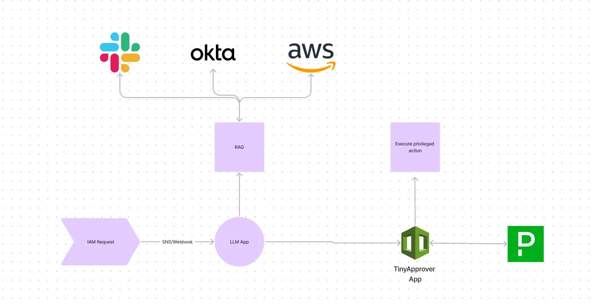

# TinyApprover
### (WIP) A framework for adding decision making & automatic actions to traditional alerting.

## Summary
Incident response is broken. Too often, responders triage alerts with minimal context and must follow complex runbooks or improvise to resolve the alert.

This projects aims to provide an easy way to respnd to common alerts with a simple approve/deny action-based workflow. It can be configured with or without an LLM app as the alert source.

## Requirements
- AWS Account (to deploy the CloudFormation stack)
- PagerDuty Account (Free tier good for 100 requests/month)

## Quickstart
Please see [SETUP.md](https://github.com/cjfit/tinyapprover/blob/main/SETUP.md)

## Deep Dive 
This is a technical README. For more information about TinyApprover, see the [full blog article writeup.](https://medium.com/open-door-security/introducing-tinyapprover-extend-traditional-alerting-with-approvals-f4d353e28276)

## Use cases
TinyApprover can be configured depending on your specific use case.
- (Recommended) - Want to connect to an LLM app and leverage retrieval augmented generation (RAG)?
     - Please see [LLM_APP.md](https://github.com/cjfit/tinyapprover/blob/main/examples/LLM_APP.md)
- Want to have a few static actions that can be triggered from incident comments?
     - This is easier to implement - and more testable - than a runbook. Check out [STATIC_ACTIONS.md](https://github.com/cjfit/tinyapprover/blob/main/examples/STATIC_ACTIONS.md)

## Design Choices
### Why OAuth2 over the PagerDuty REST API key or Events API?
- While the PagerDuty V2 Events API has slightly lower latency, its intended use is for quickly triggering incidents and there's less customization in the fields that can be sent (e.g. urgency, description)
- PagerDuty REST API keys are easy to use but can be overly permissive without the option for scoped access.

## FAQ

### Is this secure?
This is more of a proof-of-concept addressing the importance of human input in Human-Computer Interaction (HCI) design. There is no level of support guaranteed, this has not been fully threat modeled, and is not associated with or affiliated any of the platforms used.

### How much do you cost?

TinyApprover is currently open-source and completely self hosted. 

### Why do I need PagerDuty to use TinyApprover?

Human-in-the-loop is very similar to incident response, in that it's pretty urgent it's acknowledged and acted upon by a special team in most cases. PagerDuty just works great for this, however I'm open to suggestions for more integrations.

### Can you build support for GCP/Azure/OpsGenie/ServiceNow?

I will welcome contributions but have no plans to expand support at this time.